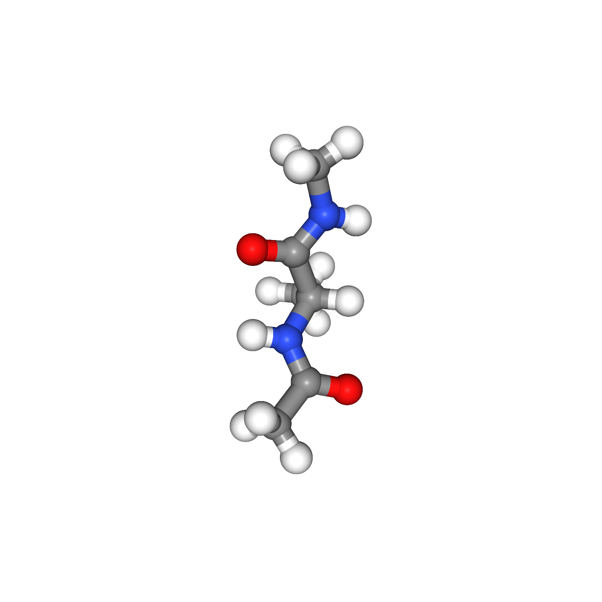
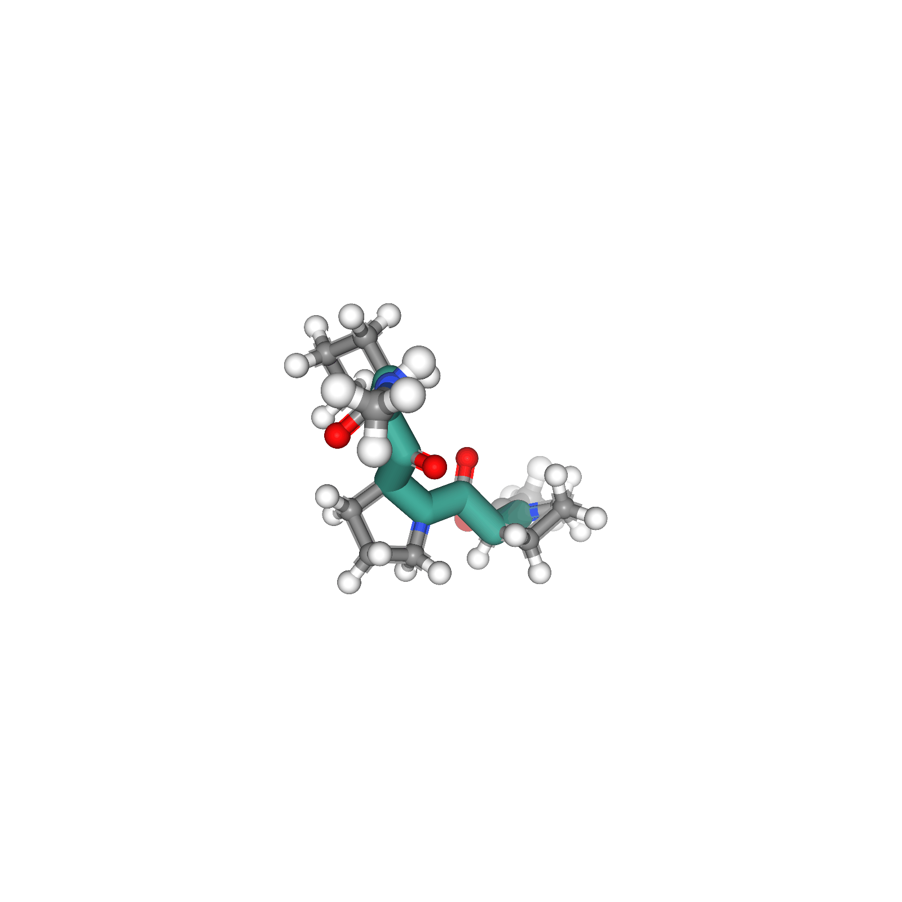

# [Collective Variable Free Transition Path Sampling with Generative Flow Networks](https://arxiv.org/abs/2405.19961v2)

## Installation

1. First, create a new Conda environment:
    ```
    conda create -n tps-gfn python=3.9
    ```

2. Activate the newly created environment:
    ```
    conda activate tps-gfn
    ```

4. Install the openmmtools for Molecular Dynamics (MD) simulation using the following commands:
    ```
    conda install -c conda-forge openmmtools
    ```

5. Install the openmmforcefields for forcefields of large proteins using the following commands:
    ```
    git clone https://github.com/openmm/openmmforcefields.git
    ```
6. Install another packages using the following commands:
    ```
    pip install torch tqdm wandb mdtraj matplotlib
    ```

## Usage

- **Training**: Run the following command to start training:
    ```
    bash scripts/train_alanine.sh
    ```

- **Evaluation**: Run the following command to perform evaluation:
    ```
    bash scripts/eval_alanine.sh
    ```

## Reproduce

- **Table**: Run the following command to reproduce the table:
    ```
    bash scripts/reproduce_table.sh
    ```

- **Visualization**: Run the following command to reproduce the figure:
    ```
    bash scripts/reproduce_figure.sh
    ```

## Results

**Alanine Dipeptide**


**Polyproline**


**Chignolin**

